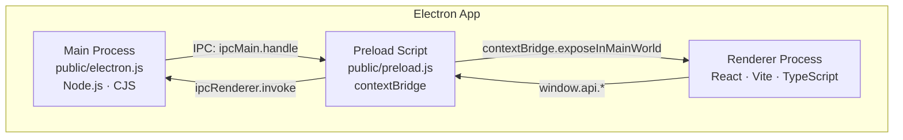
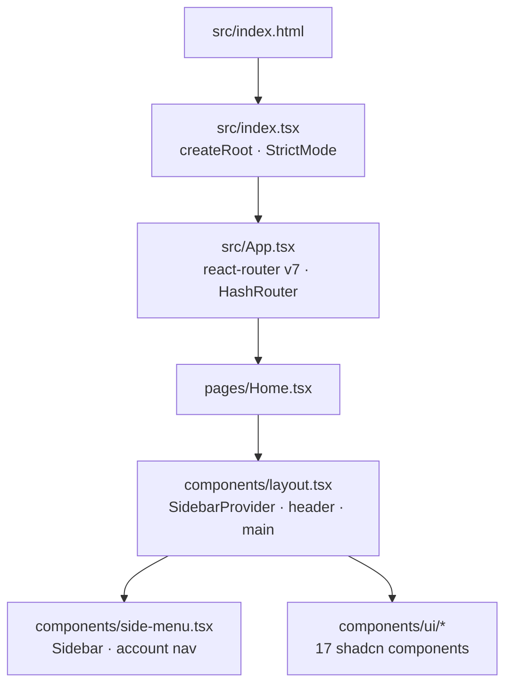
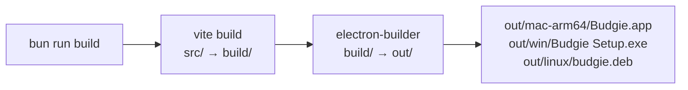

# Project Architecture

## Overview

Budgie is a desktop personal finance app built with **Electron 40**, **React 19**, **TypeScript**, and **Tailwind CSS v4**. Vite handles the renderer build; electron-builder packages the final binaries.



---

## Process Architecture

| Process  | Entry point          | Runtime             | Responsibilities                        |
| -------- | -------------------- | ------------------- | --------------------------------------- |
| Main     | `public/electron.js` | Node.js (CJS)       | Window management, SQLite, IPC handlers |
| Preload  | `public/preload.js`  | Node.js (sandboxed) | Expose safe API surface to renderer     |
| Renderer | `src/index.tsx`      | Chromium            | React UI, routing, user interaction     |

The main process creates a single `BrowserWindow`. In dev it loads `http://localhost:3000` (Vite dev server); in production it loads `file://…/build/index.html`.

> **Current state:** `contextIsolation` is disabled and the preload script is empty. This will be replaced by the Three-Layer Bridge described in the [Database Access](#database-access) section once the data layer is built.

---

## Frontend Structure



### Routing

Routing uses **react-router v7**. `HashRouter` is used intentionally — hash-based URLs work correctly with `file://` in production without requiring a dev server to handle navigation.

```
/     → pages/Home.tsx      (only route currently defined)
```

Future routes per the feature spec: Overview, Accounts, Transaction Register, Scheduled Payments, Budget, Reports.

### Layout

`components/layout.tsx` is the persistent shell:

- `SidebarProvider` — React context managing open/collapsed state (persisted to a cookie)
- `SideMenu` — fixed left rail with branding and account navigation
- Sticky `<header>` — holds the sidebar toggle (`Cmd/Ctrl+B`)
- `<main>` — page content area

### Component Library

Components live in `src/components/ui/` and follow the shadcn pattern using `@base-ui/react` primitives (not Radix). Included: Button, Card, Input, Select, Textarea, Badge, Sheet, Sidebar, Tooltip, Dropdown, Alert Dialog, Combobox, and others.

---

## Build Pipeline



### Dev

```
bun run start
├── vite              → serves src/ at localhost:3000
└── electron-start    → wait-on :3000, then electron .
```

`app.isPackaged` is `false` when running via `electron .`, so `isDev = !app.isPackaged` evaluates to `true`.

### Production

1. `vite build` — bundles the React app into `build/` with `base: "./"` (relative asset paths, required for `file://`)
2. `electron-builder` — packages `build/**/*` + `public/electron.js` + `package.json` into `out/`

Key Vite options:

| Option              | Value                           | Why                                        |
| ------------------- | ------------------------------- | ------------------------------------------ |
| `root`              | `src/`                          | HTML entry is `src/index.html`             |
| `base`              | `./`                            | Relative asset URLs for `file://` protocol |
| `build.outDir`      | `../build`                      | One level up from root, at repo root       |
| `external`          | `electron`, `electron-settings` | Native modules, not bundleable             |
| `server.strictPort` | `true`                          | `wait-on` depends on a fixed port          |

---

## Styling

Tailwind v4 is configured entirely in CSS — there is no `tailwind.config.ts`. Configuration, design tokens, and theme mapping all live in `src/index.css`.

### Design Tokens

Colors use the `oklch()` color space. Key tokens:

| Token           | Light                                | Dark             |
| --------------- | ------------------------------------ | ---------------- |
| `--background`  | white                                | near-black       |
| `--foreground`  | near-black                           | near-white       |
| `--primary`     | `oklch(0.51 0.23 277)` — blue/indigo | slightly lighter |
| `--secondary`   | light grey                           | dark grey        |
| `--destructive` | `oklch(0.577 0.245 27.325)` — red    | muted red        |
| `--radius`      | `0.45rem`                            | same             |

Dark mode is class-based: add `.dark` to an ancestor element (not a media query).

A 5-step chart palette is defined (`--chart-1` through `--chart-5`) in the blue range.

### Theme Mapping

An `@theme inline` block maps all CSS variables into Tailwind's utility system:

```css
@theme inline {
  --font-sans: "Noto Sans Variable", sans-serif;
  --color-primary: var(--primary);
  --color-background: var(--background);
  /* … all tokens */
}
```

This makes `bg-primary`, `text-foreground`, `rounded-sm` etc. all resolve to the CSS variables — enabling runtime theme switching by toggling `.dark`.

---

## State Management

Currently state is managed in two ways:

1. **`SidebarContext`** — the only React context; tracks open/collapsed state and persists it to a cookie (`sidebar_state`, 7-day max-age).
2. **Local `useState`** — all other stateful logic is component-local.

A global state management library will be added to handle app-level state (active account, UI state, cached IPC data). Active account selection in `side-menu.tsx` is currently a `console.log` stub pending this.

The data state model (transactions, accounts, categories, scheduled payments) will be owned by the Main process in SQLite and surfaced to the renderer via IPC, described below.

---

## Database Access

In 2026, the best practice for building an Electron app with a local SQLite database follows a "Main-as-Server" architecture. Because the Renderer process (your UI) is essentially a browser, it should never have direct access to the database for security and performance reasons.

### 1. Recommended Architecture: The Three-Layer Bridge

To keep your app secure and performant, you must separate your concerns into three distinct layers:

**Main Process (The Controller):** This is where your Node.js code lives. It owns the SQLite connection and executes all SQL queries.

**Preload Script (The Gatekeeper):** A secure bridge that exposes a limited, safe API to the UI using `contextBridge`.

**Renderer Process (The UI):** Your React frontend. It "asks" the Main process for data via IPC (Inter-Process Communication) and receives a Promise in return.

### 2. Choosing Your SQLite Driver

Use `better-sqlite3`.

### 3. Implementation Blueprint

**Step A: The Main Process (main.js)**

Initialize the database in the Main process and set up an `ipcMain.handle` listener.

```js
import { app, ipcMain } from "electron";
import { drizzle } from "drizzle-orm/better-sqlite3";
import Database from "better-sqlite3";
import path from "path";

// The database should be in the user's local app data folder
const dbPath = path.join(app.getPath("userData"), "database.db");
const sqlite = new Database(dbPath);
export const db = drizzle(sqlite);

// Handle requests from the UI
ipcMain.handle("get-users", async () => {
  return db.prepare("SELECT * FROM users").all();
});
```

**Step B: The Preload Script (preload.js)**

Expose only the necessary function to the window object. Do not expose the entire `ipcRenderer` for security.

```js
const { contextBridge, ipcRenderer } = require("electron");

contextBridge.exposeInMainWorld("api", {
  getUsers: () => ipcRenderer.invoke("get-users"),
});
```

**Step C: The Renderer (Your Frontend)**

Call the API as if it were a standard web service.

```js
// In your React component
const users = await window.api.getUsers();
console.log(users);
```

### 4. Pro Tips for 2026

**WAL Mode:** Always enable Write-Ahead Logging (`db.pragma('journal_mode = WAL')`) to allow multiple readers and one writer simultaneously without locking the UI.

**Externalize Native Modules:** Ensure `better-sqlite3` is marked as an `external` in the Vite config, as it contains native C++ binaries that cannot be bundled into a single JS file.

**Security:** Never pass raw SQL strings from the Renderer to the Main process. This prevents SQL injection within your own desktop app. Always use Prepared Statements in the Main process.
