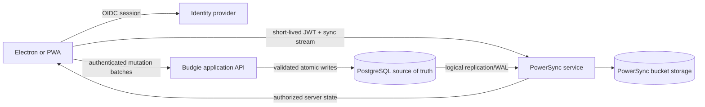

# Budgie Hosted Sync Architecture Plan

## 1. Status and Scope

This document records a future architecture recommendation so the web and data
platform can avoid choices that would make hosted sync unnecessarily difficult.
It is not part of the current web-target implementation.

The future sync system must:

- Keep reads and writes local-first on Electron and the PWA.
- Continue working through extended network loss.
- Synchronize a user's financial data across their devices.
- Preserve atomic financial operations and database invariants.
- Treat the hosted database as authoritative after reconciliation.
- Encrypt hosted data at rest and all network traffic in transit.
- Isolate each user's data and enforce authorization on every read and write.
- Support migrations while old, distributed clients remain in use.
- Keep the portable import/export format independent of the sync protocol.

Shared household access, end-to-end encryption, collaborative editing, and the
final conflict UX remain separate product decisions.

## 2. Recommendation

Use **PowerSync with PostgreSQL and a Budgie-owned application backend** as the
first implementation candidate.

This is a provisional recommendation, not a dependency decision. PowerSync is
currently the strongest fit because it provides:

- A production JavaScript web SDK with local SQLite and offline writes.
- Browser workers and IndexedDB/OPFS VFS options, including a single-tab
  `AccessHandlePoolVFS` suitable for Budgie's current requirement.
- JavaScript clients for web, Node.js, and Electron scenarios.
- Official Drizzle integration.
- Transaction-grouped, durable client upload queues.
- User-filtered partial sync through Sync Streams.
- PostgreSQL logical-replication integration.
- Managed cloud and self-hosted service options.

Use PostgreSQL as the hosted system of record. Put an authenticated Budgie API
between clients and PostgreSQL for all uploaded writes. PowerSync distributes
authorized server state back to clients; it must not be treated as the write
authorization layer.

For an initial production service, prefer a managed PostgreSQL provider and
PowerSync Cloud over self-hosting the sync service. This reduces the operational
and security burden while the product is young. Reconsider self-hosting for data
residency, cost, contractual, or infrastructure-control requirements.

Do not adopt PowerSync until the spike in section 10 passes. Its default
JSON-backed views differ from Budgie's current native schema. Raw tables retain
native SQLite behavior but move migration, mapping, trigger, foreign-key, and
resync responsibilities into Budgie.

## 3. Proposed Topology

Cloudflare Pages continues to host only the static PWA. Authentication, the
Budgie write API, PostgreSQL, the PowerSync service, bucket storage, secrets,
backups, and observability belong to a separate protected environment.

The client should communicate with two public surfaces:

1. The Budgie API for authentication support and mutation uploads.
2. The PowerSync streaming endpoint for authorized downloads.

PostgreSQL and PowerSync bucket storage must never be exposed directly to app
clients.

## 4. Why the Alternatives Are Not the First Choice

| Candidate             | Assessment for Budgie                                                                                                                                                                                                                                                                                          |
| --------------------- | -------------------------------------------------------------------------------------------------------------------------------------------------------------------------------------------------------------------------------------------------------------------------------------------------------------- |
| **PowerSync**         | Best current fit. Browser SQLite, OPFS/IndexedDB VFS options, offline write queue, Drizzle support, Electron/Node clients, partial sync, and managed/self-hosted deployment are available. Requires adapting the local schema and building a secure write API.                                                 |
| **ElectricSQL**       | Strong PostgreSQL read-path sync and HTTP authorization model, but it deliberately does not provide write-path sync. Its documented fully local write approach uses custom shadow tables, triggers, a change-log synchronizer, and commonly PGlite. Budgie would own too much high-risk synchronization logic. |
| **Turso Sync/libSQL** | Architecturally attractive logical push/pull sync, but the current TypeScript sync package is native Node rather than a proven browser OPFS path, has no ORM support in sync mode, and the new Turso engine remains pre-1.0. Re-evaluate as it matures.                                                        |
| **CR-SQLite/VLcn**    | Offers CRDT-based multi-writer SQLite replication, including WASM, but it is a lower-level toolkit. Budgie would need to build and secure the relay, authorization, partial replication, operations, and financial conflict model. CRDT convergence alone does not protect accounting invariants.              |
| **SQLite Cloud**      | Promising SQLite-compatible managed database and access control, but current public evidence is insufficient for selecting a mature browser-resident, bidirectional offline sync path across Budgie's targets. Re-evaluate during the spike.                                                                   |

Avoid selecting an engine only because it uses SQLite. The deciding requirement
is a supported browser offline-write path with deterministic reconciliation,
authorization boundaries, migration support, and observable failure handling.

## 5. Client Database and WAL Implications

WAL must remain an adapter-owned detail:

- The current Electron `better-sqlite3` adapter may continue using WAL.
- The no-sync browser baseline can use official SQLite `opfs-sahpool` without
  WAL.
- PowerSync's browser `AccessHandlePoolVFS` is the likely cross-browser,
  single-tab choice and does not require WAL.
- PowerSync's `OPFSWriteAheadVFS` enables parallel readers but is currently
  Chromium-only, so it does not meet Budgie's browser target.
- If PowerSync later owns the Electron database, its Node/Electron adapter must
  control journal and checkpoint behavior.
- PostgreSQL WAL is independently required for logical replication. Replication
  slot lag must be monitored because a stalled sync service can retain WAL and
  exhaust server storage.
- Turso Sync has its own WAL and checkpoint lifecycle; selecting it later would
  replace this storage profile rather than augment it.

No shared domain code should issue journal-mode pragmas. Database factories own
that configuration and expose only tested capabilities.

## 6. Schema Readiness

Resolve these choices in a sync compatibility spike before finalizing the
web-target schema migration:

### Identity

PowerSync requires each synced output table to expose a text primary key named
`id`. Prefer UUIDv7 identifiers generated on the client and stored as PostgreSQL
`uuid` values. They are safe to create offline and sortable enough for indexes.

Budgie must choose one of two models:

1. Promote UUID text IDs to canonical keys in every local relationship.
2. Retain integer local keys and maintain UUID public keys plus mapping at every
   sync boundary.

The first model is the recommended long-term direction because it removes ID
translation from imports, sync, relationships, and conflict records. It is a
larger migration, so prove it against existing queries and fixtures first.

### Ownership and versioning

Every hosted syncable row needs an immutable owner or workspace identifier.
Use a `workspace_id` even for single-user v1 data if shared households are a
credible future feature. Membership determines access; clients never choose an
unverified owner in a mutation.

Add only metadata with defined semantics:

- `created_at`: server-normalized UTC creation time.
- `updated_at`: server-generated display/audit time, not a sole conflict clock.
- `version`: server-controlled monotonic row version where stale writes must be
  detected.
- `deleted_at`: only where soft deletion, retention, undo, or audit requires it.
- `created_by` and `updated_by`: where audit value justifies the storage.

PowerSync can replicate hard deletes, so tombstones are not automatically
required on every table. Add them according to Budgie's conflict, retention,
and audit policy rather than speculatively.

### Constraints

Preserve foreign keys, uniqueness, and financial checks in PostgreSQL as the
authoritative enforcement layer. If PowerSync raw tables are used locally,
foreign keys must be deferred because synced rows are not applied in a
controllable order.

## 7. Write and Conflict Model

PowerSync is server-authoritative and defaults to per-field last-write-wins if
the backend applies generic patches. That default is insufficient for all
Budgie operations.

Classify writes before implementation:

- **Safe last-write-wins:** low-risk preferences or labels where replacing a
  field cannot invalidate financial state.
- **Version-checked writes:** account/category/payee edits and other mutable
  records where a stale update should be rejected or surfaced.
- **Atomic domain commands:** transfers, reconciliation, budget moves,
  auto-posting, linked transaction updates/deletes, and import replacement.
- **Append-oriented records:** consider immutable correction entries rather
  than overwriting historical financial events where practical.

The backend must:

- Accept an allowlisted command or mutation schema, never arbitrary client SQL,
  table names, or column names.
- Derive user/workspace ownership from the authenticated session.
- Validate every referenced row belongs to that workspace.
- Process every client transaction group in one PostgreSQL transaction.
- Preserve all-or-nothing behavior for transfer pairs and reconciliation.
- Deduplicate retries using the PowerSync client ID and operation ID, or a
  Budgie command ID, under a database uniqueness constraint.
- Return success only after the PostgreSQL transaction commits.
- Reserve retryable errors for temporary failures; record validation/conflict
  outcomes in a user-scoped table that syncs back to the client.
- Maintain an audit trail for rejected and security-sensitive operations
  without logging account names, payees, notes, balances, or payload bodies.

For high-value conflicts, prefer server-controlled row versions and a visible
conflict record over client timestamps. Device clocks are not authoritative.

## 8. Import, Export, and Account Lifecycle

The versioned portable data package remains the cross-platform interchange
format and must not contain PowerSync internals, upload queues, checkpoints, or
provider credentials.

Before sync is enabled, import remains an atomic local overwrite.

After a database joins a synced account:

- Export reads a consistent local snapshot and remains portable.
- Import must be performed as an authenticated server-side replace command.
- The server validates the complete package, replaces the workspace in one
  transaction, records an audit event, and causes clients to perform a clean
  resync.
- A client with pending writes cannot import until those writes are resolved or
  explicitly discarded.
- Signing out must close the database, clear user-scoped local data and auth
  material, and verify no previous user's rows remain accessible.
- Account deletion requires a documented retention window, server deletion,
  bucket cleanup, local purge, and backup-expiry process.

## 9. Hosted Security and Operations

Treat this environment as a financial-data service even if it does not move
money.

### Identity and authorization

- Use an established OIDC provider with passkeys/MFA support rather than
  implementing passwords.
- Use short-lived access tokens, rotating refresh tokens, and explicit device
  session revocation.
- Issue short-lived, audience-restricted PowerSync JWTs using asymmetric keys
  exposed through JWKS.
- Scope Sync Streams only with signed auth claims. Client-controlled parameters
  may narrow data but must never widen authorization.
- Enforce the same ownership rules independently in the write API and database.
- Add rate limits to login, token, write, import, and export endpoints.

### Network and secrets

- Require TLS for every public and service-to-service connection.
- Place PostgreSQL and bucket storage on private networks with least-privilege
  service accounts and verified TLS.
- Expose PowerSync only through a streaming-capable load balancer with response
  buffering disabled.
- Keep admin APIs private and require separate credentials.
- Store secrets in a managed secret store, rotate them, and never put provider
  or database credentials in the PWA.

### Data protection

- Enable provider-managed encryption at rest with managed keys for PostgreSQL,
  bucket storage, backups, and logs.
- Encrypt backups, test restoration, define retention, and support deletion
  obligations.
- Keep local-device encryption out of scope as already decided; clearly state
  that device and browser-profile security protect local data.
- Do not place financial values or free-text fields in URLs, metrics, traces,
  exception reports, or routine logs.

### Reliability

- Run PostgreSQL with point-in-time recovery and tested restores.
- Monitor replication-slot WAL retention, replication lag, API latency, upload
  queue age, rejected mutations, bucket storage, and failed auth.
- Separate staging and production databases, keys, domains, and identity
  clients.
- Pin sync service and SDK versions; rehearse service, schema, and client
  compatibility upgrades before production.
- Define recovery objectives and an incident response process before launch.

### Self-hosting size

For a very low-usage deployment, a single VPS can run the Budgie API, PowerSync
API and replication roles, PostgreSQL source database, and PostgreSQL PowerSync
bucket storage. This is suitable for an early production service where an
occasional full outage is acceptable; it is not highly available.

Use PostgreSQL 14 or newer so the source and bucket-storage databases can share
one PostgreSQL server. Keep them in separate databases or schemas with separate,
least-privilege users. This reduces the footprint compared with adding MongoDB,
although PowerSync notes that sharing a PostgreSQL server may increase CPU use.

| Environment                           | vCPU |    RAM |        Storage | Intended use                                                                         |
| ------------------------------------- | ---: | -----: | -------------: | ------------------------------------------------------------------------------------ |
| Development or pilot                  |    2 |   4 GB |     50 GB NVMe | A handful of users, disposable previews, and technical spikes                        |
| Comfortable low-usage production      |    4 |   8 GB | 80-100 GB NVMe | Small user base with room for maintenance, compaction, backups, and transient load   |
| PowerSync/API with managed PostgreSQL |    2 | 2-4 GB |       20-40 GB | Application and sync services only; database durability is delegated to the provider |

The comfortable single-VPS estimate allows approximately:

- 0.5-1 GB for a combined low-traffic PowerSync process.
- 2-3 GB for PostgreSQL source and bucket-storage workloads plus page cache.
- Less than 0.5 GB for the Budgie API and reverse proxy.
- Up to 1 GB temporarily for a PowerSync compact job.
- Remaining memory for the operating system, filesystem cache, deployment
  overlap, and traffic spikes.

PowerSync documents 512 MB and 1 vCPU for a combined development compute
container. Its production starting point is 1 GB and 1 vCPU for each separate
replication or API container, and its compact job may use up to 1 GB. Those
figures do not include the source database, bucket storage, Budgie API, reverse
proxy, backups, or operating-system headroom, so they should not be treated as
whole-server sizing.

Disk sizing must allow substantially more than the expected user data. The
source database, PowerSync bucket data, indexes, temporary files, backups, and
PostgreSQL WAL coexist on the host. A stalled logical-replication slot can retain
WAL indefinitely and fill the disk. Monitor replication slot lag and disk use,
alert by 60-70% utilization, and keep backups off the VPS.

For the single-VPS topology:

- Use x86-64 Linux and SSD/NVMe storage with reliable `fsync` behavior.
- Expose only HTTPS through a streaming-capable reverse proxy; never expose
  PostgreSQL publicly.
- Disable proxy response buffering for PowerSync HTTP streams.
- Use encrypted daily offsite PostgreSQL backups and provider snapshots, and
  perform restoration drills.
- Configure container memory limits and PowerSync's Node heap percentage so a
  compact job or initial sync cannot starve PostgreSQL.
- Monitor memory, CPU, disk latency, disk capacity, PostgreSQL connections,
  replication lag, retained WAL, and PowerSync connection count.
- Scale vertically first at this usage level. Split PostgreSQL onto a managed
  service before adding PowerSync replicas if database durability is the main
  concern.

A 2 vCPU/4 GB VPS is expected to work at very low load, but it is a cost-first
choice rather than a comfortable production size. The 4 vCPU/8 GB recommendation
provides useful operational margin without implying high availability.

PowerSync client SDKs are Apache-2.0. The self-hosted service uses
FSL-1.1-ALv2 and converts each release to Apache-2.0 after two years. Complete a
license and pricing review before committing, especially if Budgie's future
distribution or service model could be considered competitive.

## 10. Required Spike and Decision Gate

### Repository-local browser VFS result

On 2026-09-18, a disposable Vite probe ran the existing 13-migration, query,
`RETURNING`, transaction rollback, reload, and close contract through
PowerSync 2.3.1 in a Chromium-compatible browser. Both
`AccessHandlePoolVFS` and `OPFSCoopSyncVFS` passed that local contract and
persisted data across reopen.

This does not approve PowerSync. The SDK's normal schema is view-based and
does not automatically consume Budgie's Drizzle migration history. The probe
used a local schema and raw SQL tables to establish VFS feasibility only.
`AccessHandlePoolVFS` is single-tab and unsuitable as the Safari/iOS choice;
`OPFSCoopSyncVFS` is the documented cross-browser option. Neither removes the
need for Budgie's one-active-tab policy.

Build a disposable vertical slice before changing production schema:

1. Run two browser clients and one Electron client against a test PostgreSQL
   database and PowerSync instance.
2. Use the existing accounts, categories, transactions, and transfer behavior.
3. Test PowerSync managed views and raw tables; measure aggregate-report query
   performance and Drizzle compatibility.
4. Verify `AccessHandlePoolVFS` persistence and offline writes on current iOS,
   iPadOS, Android, Firefox, and Chromium.
5. Prove a transfer mutation uploads as one idempotent PostgreSQL transaction.
6. Simulate duplicate delivery, stale updates, delete/update races, rejected
   writes, interrupted uploads, long offline periods, and token expiry.
7. Prove migrations across two simultaneously supported client versions.
8. Measure first sync, resume sync, storage use, upload latency, and large
   reports using representative Budgie data.
9. Test logout purge, revoked sessions, cross-user isolation, and malicious
   mutation payloads.
10. Compare managed PowerSync cost and controls with a small self-hosted
    deployment; complete license and threat-model reviews.

Approve PowerSync only if this demonstrates:

- Identical domain invariants on local and hosted paths.
- Acceptable mobile performance and cross-browser persistence.
- A migration strategy that does not require destructive local resets while
  offline.
- Deterministic recovery from validation failures and conflicts.
- No data exposure across users, workspaces, logs, previews, or environments.
- An operational model proportionate to Budgie's expected user base and budget.

If the spike fails, retain the platform-neutral database and domain interfaces,
re-evaluate Turso Sync and SQLite Cloud, and use Electric only if Budgie is
prepared to own a persistent offline write queue and reconciliation layer.

## 11. Future Delivery Sequence

1. Threat model, privacy model, and provider/license decision.
2. Identity provider, workspace model, and account lifecycle.
3. PostgreSQL schema, migrations, constraints, backups, and audit model.
4. Budgie write API with idempotent domain commands.
5. PowerSync configuration, Sync Streams, and hosted operations.
6. Client opt-in, initial upload, sync status, conflict, and recovery UX.
7. Multi-device and adversarial integration testing.
8. Closed beta with monitoring and restore drills.
9. Production rollout with a local-only mode retained where practical.

## 12. Sources Reviewed

Research was performed against current documentation on 2026-09-17:

- PowerSync architecture, web SDK, VFS options, raw tables, Drizzle support,
  Sync Streams, write handling, conflict handling, self-hosting, and security:
  <https://docs.powersync.com/>
- PowerSync JavaScript SDK and service licenses:
  <https://github.com/powersync-ja/powersync-js> and
  <https://github.com/powersync-ja/powersync-service>
- Electric read-path sync, authorization, and write patterns:
  <https://electric.ax/docs/sync>
- Turso Database and Turso Sync capabilities:
  <https://docs.turso.tech/> and <https://github.com/tursodatabase/turso>
- CR-SQLite/VLcn replication model:
  <https://vlcn.io/docs/cr-sqlite/intro>
- SQLite Cloud architecture and access control:
  <https://docs.sqlitecloud.io/>
