# Web Route Map

The current application uses `HashRouter`. Route redesign is intentionally
deferred to Phase 5.

```mermaid
flowchart TD
  App --> Router[HashRouter + Layout]
  Router --> Home["/"]
  Router --> Accounts["/accounts/:id"]
  Router --> Categories["/categories"]
  Router --> Payees["/payees"]
  Router --> Scheduled["/scheduled"]
  Router --> Reconcile["/reconcile/:id"]
  Router --> Forecast["/forecast/:id"]
  Router --> Settings["/settings"]
  Router --> Budget["/budget"]
  Router --> Reports["/reports"]

  Home --> AccountForm[Account form dialog]
  Home --> ReconcileDialog[Reconciliation dialog]
  Accounts --> TransactionForm[Transaction form dialog]
  Accounts --> ImportDialog[Import dialog]
  Accounts --> AccountReconcile[Reconciliation dialog]
  Accounts --> DeleteTransaction[Delete confirmation]
  Categories --> CategoryForm[Category form]
  Categories --> DeleteCategory[Delete confirmation]
  Payees --> PayeeForm[Payee form]
  Payees --> DeletePayee[Delete confirmation]
  Scheduled --> ScheduledForm[Scheduled payment dialog]
  Scheduled --> RecordPayment[Record payment dialog]
  Scheduled --> DeleteScheduled[Delete confirmation]
  Reconcile --> ReconcileTransaction[Transaction form dialog]
  Forecast --> ForecastHelp[Forecast help dialog]
  Settings --> About[About dialog]
  Settings --> Backup[Backup dialog]
  Settings --> Restore[Restore dialog]
  Settings --> ImportConfirm[Import confirmation]
  Budget --> EnvelopeForm[Envelope form dialog]
  Budget --> MoveMoney[Move money dialog]
```

The shell also owns navigation, account switching, update actions, and global
menus. Several components use `Sheet` terminology internally, but most current
data-entry workflows render as dialogs. Phone-specific full-height sheets and
focused routes require Phase 5 product approval.
