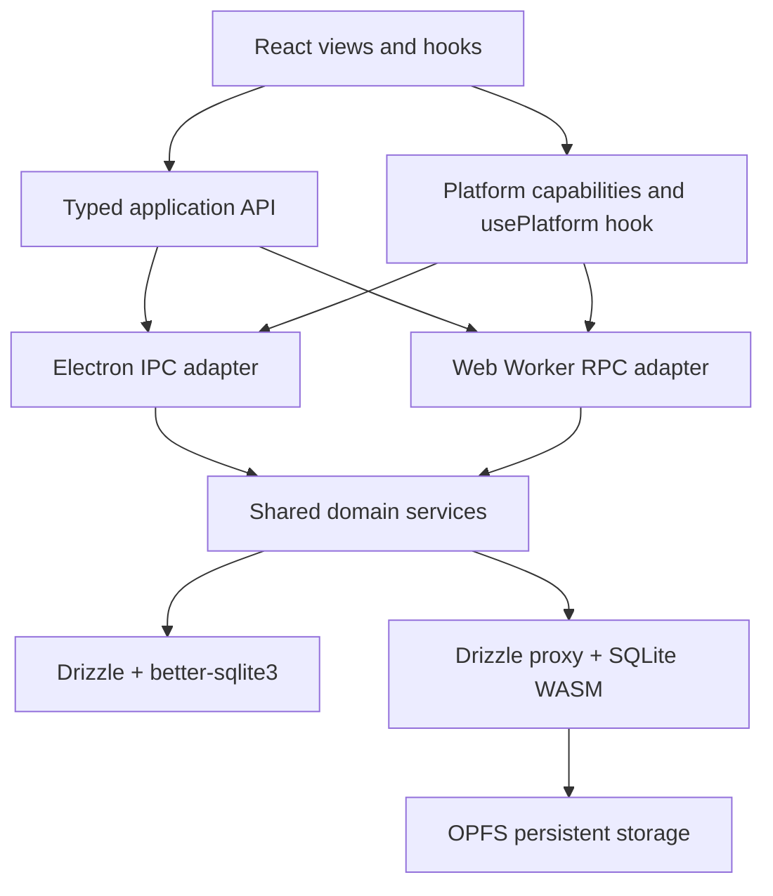

# Budgie Web and Mobile Target Plan

## 1. Goal

Build a mobile- and tablet-first hosted PWA from the existing codebase while
retaining Electron as a supported target.

The PWA must:

- Work fully offline after its first successful load.
- Keep financial data locally in SQLite WASM.
- Support current greenfield mobile browsers.
- Permit only one active tab per origin.
- Share schema, domain behavior, migrations, types, and most UI code with
  Electron.
- Exchange data with Electron through a versioned serialized format.
- Leave cloud sync and hosted-data encryption out of scope for this delivery.
  Future coupling constraints and the current engine recommendation are recorded
  separately in `docs/SYNC_ENGINE_PLAN.md`.

Implementation will be incremental, with explicit approval of each redesigned
workflow.

## 2. Delivery Order

The work should proceed in this order:

1. SQLite WASM feasibility and browser persistence gates.
2. Provider-neutral sync-ready data structure and shared data contract.
3. Shared domain services.
4. Cross-platform import/export.
5. Web runtime and offline PWA tooling.
6. Incremental mobile/tablet UX releases.
7. Tag-driven production deployment.

This proves local data portability and behavior in Electron before introducing
the web platform. Hosting, sync-engine selection, and sync protocol design
belong to `docs/SYNC_ENGINE_PLAN.md`; this plan only prepares the data
structure and contracts for a future engine.

## 3.1 Current Status and Resume Point

Status as of 2026-09-17: phase 0 has a passing desktop-browser feasibility
probe, but the web target has no production runtime yet. The probe was removed
after its findings were recorded. The durable follow-up checklist is
`docs/WEB_IMPLEMENTATION_TASKS.md`.

Completed in this work:

- Added and then removed the disposable official SQLite WASM probe dependency,
  worker, harness, and command.
- Verified official SQLite WASM 3.53.4 with `opfs-sahpool` in a Vite worker.
- Verified JSON functions, foreign keys, aggregate queries, `RETURNING`,
  rollback, and persistence across probe reload.
- Bundled and executed all 13 existing migrations in a browser worker; a fresh
  database applied all 13 and reload skipped all 13.
- Verified the browser executor recognizes all 13 rows written by the real
  Electron Drizzle migrator in an in-memory SQLite contract test.
- Verified the same migration metadata compatibility against a physical,
  WAL-enabled Electron database file.
- Verified the migration worker in current Chromium: first load applied all 13
  migrations and reload skipped all 13 through OPFS persistence.
- Measured a Chromium persisted-database reopen at approximately 132 ms in the
  local profile; `navigator.storage.persisted()` was false, so eviction safety
  remains unproven.
- An explicit Chromium `navigator.storage.persist()` request also returned
  false on localhost; the eventual runtime must handle denied persistence
  distinctly and avoid claiming eviction protection.
- Verified Safari 27 first-load migration execution: all 13 migrations applied
  in approximately 193 ms; `persist()` returned false and `persisted()` stayed
  false in the localhost profile.
- Verified Safari reload persistence: a second load skipped all 13 migrations
  in approximately 199 ms; persistent-storage protection remained denied.
- Began phase 1 with a platform-neutral `ApplicationAPI` type name and an
  injectable `usePlatform()` capability service; existing Electron consumers
  remain unchanged.
- Added the shared asynchronous `DatabaseCapability` contract, a WAL-enabled
  Electron adapter, and a persistent SQLite WASM worker/client with serialized
  RPC transactions; the browser smoke test passed query, transaction, and
  close behavior.
- Extracted the first typed shared domain service for accounts, including
  balance projections, transfer-category side effects, and reference-aware
  soft deletion, with migrated SQLite tests.
- Extracted the atomic reconciliation service with rollback coverage.
- Extracted transaction reads, atomic transfer creation, and guarded deletion
  with migrated SQLite tests; transfer-aware amount/payee propagation is now
  covered, category conversion is covered in both directions.
- Wired the extracted accounts, transactions, and reconciliation services into
  Electron IPC through a built CommonJS service bundle and the existing SQLite
  connection. Settings, payees, categories, envelopes, mappings, and budgets
  now use the same path.
- Moved account reconciliation CRUD onto the shared service path; backups and
  QIF import remain native Electron boundaries.
- Moved scheduled CRUD and startup auto-posting behind the shared async service;
  overdue posting and exhausted-schedule removal have migrated SQLite tests.
- Added fail-closed browser command sequencing and a Web Lock/BroadcastChannel
  coordinator; web startup and inactive-instance UI integration remain.
- Connected the browser lock, SQLite worker, persistence request, and shared
  auto-post operation in a web runtime initializer with resume/shutdown hooks.
- Connected the web runtime to React startup, installed the browser
  `ApplicationAPI` over shared services, and added explicit inactive/startup
  failure states; native-only operations now report unsupported behavior.
- Added cross-origin isolation headers to `vite.config.ts` for the future
  worker/OPFS path.
- Added migration `0013_chilly_dorian_gray` for provider-neutral sync-ready
  metadata: stable public IDs, lifecycle timestamps, deterministic legacy-row
  backfill, unique indexes, update triggers, and tombstone-only delete guards.
- Converted shared services and legacy IPC adapters to retain syncable rows as
  tombstones while filtering them from active reads; settings remains
  device-local.
- Passed `bun run lint` and `bun run check-types` after cleanup.
- Completed the local-only version-1 Portable Data Package, including
  cross-platform export/import adapters, public-ID relationship mapping,
  atomic tombstone-preserving overwrite, validation, golden fixtures, and
  regression coverage.

Next work, in order:

1. Complete the manual Phase 4 acceptance checklist in
   `docs/PHASE4_MANUAL_CHECKLIST.md`.
2. Record Safari, mobile-device, storage-pressure, performance, and Cloudflare
   deployment results in `docs/WEB_IMPLEMENTATION_TASKS.md`.
3. Begin Phase 5 only after product approval of the route and modal redesign
   map in `docs/WEB_ROUTE_MAP.md`.

Phase 1 local foundation status: complete. The shared platform/API boundary,
database adapters, domain services, Electron IPC bundle, browser startup
lifecycle, inactive-tab handling, persistence state, and local contract tests
are implemented. External phase 0 browser/deployment/performance validation
remains a separate gate before production web release.

Phase 4 local implementation status: complete. The web build boundary,
security headers, deterministic offline precache, user-confirmed service-worker
updates, generated-artifact checks, Chromium release tests, route map, and
Cloudflare deployment workflows are implemented. Production approval remains
blocked only on the manual acceptance checklist and environment credentials /
policies described there.

The next coding session should begin Phase 5 UX redesign after the manual
Phase 4 acceptance gate. Do not select a sync engine or hosting model from this
plan; those decisions are owned by `docs/SYNC_ENGINE_PLAN.md`.

Provider-neutral Sync-Ready Data Structure status: complete for the current
scope. Existing integer relationships remain intact, while syncable entities
now have stable public IDs, lifecycle metadata, deterministic legacy
backfill, unique indexes, tombstones, and centralized delete/update behavior.
Canonical public-key strategy and provider-specific schema remain deferred to
`docs/SYNC_ENGINE_PLAN.md`.

Current validation scope: Chromium and Safari are the approval baseline.
Physical mobile-device and Firefox coverage is deferred until before public
mobile launch or if browser storage behavior changes materially.

## 3. Target Architecture

Replace the Electron-specific `window.api` type in
`src/types/electron.d.ts` with a platform-neutral application API. Existing
hooks can continue consuming the same Promise-based methods.

Add a typed platform service and reusable `usePlatform()` hook before feature
work begins. It should expose the runtime target (`web` or `electron`) and
explicit capabilities such as native update checks, filesystem backup, PWA
installation, persistent browser storage, and touch support. Components should
gate features by capability rather than inspect `window`, Electron globals, or
user-agent strings. For example, the existing new-version check is available
only when the platform reports native update support; the web target uses its
service-worker update flow instead.

Keep capability detection centralized and injectable so both targets and tests
can supply deterministic values. Device layout remains the responsibility of
responsive CSS and input media queries rather than platform detection.

Extract business behavior from `public/ipc` into shared TypeScript services.
IPC handlers become thin adapters. The web worker exposes the same operations
over command-level RPC.

All shared database operations become consistently asynchronous. Existing
`.run()` and `.all()` transaction bodies, particularly in
`public/ipc/transactions.js` and `public/ipc/scheduled-transactions.js`, cannot
be reused unchanged.

## 4. Phase 0: Technical Proof

The disposable SQLite WASM probe completed on 2026-09-17. In a Vite-served
worker with cross-origin isolation, official SQLite WASM 3.53.4 opened an
`opfs-sahpool` database and passed representative JSON, foreign-key,
aggregate, `RETURNING`, and rollback checks. Reloading the probe also confirmed
that the OPFS database persisted. This proves browser feasibility for the
no-sync baseline only; it does not approve the browser adapter, schema, sync
engine, or mobile support matrix.

The probe and its package dependency are intentionally disposable and are not
part of the application runtime. Keep the result and follow-up work in
`docs/WEB_IMPLEMENTATION_TASKS.md` rather than maintaining the synthetic
database harness on a long-running branch.

Remaining local phase 0 gates:

- Benchmark startup, migration, bulk import, reporting queries, and a large
  transaction dataset on representative iPhone, iPad, and Android hardware.
- Confirm Safari/iPadOS persistence across reload, restart, PWA installation,
  and OS storage pressure.
- Validate WASM asset loading in Vite, localhost, Cloudflare preview URLs, and
  offline mode.

Do not make WAL a permanent application-level assumption. The no-sync
`opfs-sahpool` baseline does not benefit from WAL, while a future sync SDK may
own its VFS, journal mode, and checkpoint behavior. Electron may retain its
current WAL mode until an adopted database adapter requires otherwise.

Approval gate for this plan: proceed only after transaction parity,
persistence, migration, and performance tests pass. The separate sync-engine
approval gate is defined in `docs/SYNC_ENGINE_PLAN.md`.

## 5. Phase 1: Shared Data Foundation

Refactor `src/main/db/index.ts` so Electron-specific path handling is separated
from schema and migration concerns.

Create:

- A typed platform capability service and reusable `usePlatform()` hook.
- A shared database capability interface.
- Shared domain services for accounts, transactions, reconciliation,
  scheduling, budgets, settings, and payees.
- Thin Electron IPC registration around those services.
- Contract tests that run identical behavior against the desktop and browser
  adapters.

Ensure transactions use the transaction handle throughout and execute as one
serialized worker command. This prevents unrelated queries from entering an
open browser transaction.

Move startup auto-posting into a shared operation. Run it after database
initialization and whenever the PWA resumes. Background execution while the PWA
is closed is explicitly unsupported.

## 6. Sync-Ready Data Structure

Prepare the data structure for future distributed databases without selecting
the sync protocol or hosting provider. Identity, metadata, relationship
tombstones, and portable IDs belong here; provider-specific requirements such
as PowerSync's exact local schema, hosted ownership model, and write protocol
belong to `docs/SYNC_ENGINE_PLAN.md`.

Prepare distributed databases without designing the sync protocol:

- Add a globally unique ID to every syncable entity.
- Keep the ID format and relationship contract provider-neutral. Defer the
  choice between canonical public IDs and a separate local key to the
  sync-engine spike; do not encode a provider-specific key requirement here.
- Add UTC `created_at`, `updated_at`, and nullable `deleted_at` metadata.
- Apply tombstones to relationships and entities that future sync must
  replicate.
- Backfill existing rows deterministically and add unique indexes.
- Centralize writes so metadata cannot be bypassed.
- Treat the complete current `Preferences` shape as portable for the initial
  package. Revisit individual fields during web UX design and remove any that
  prove device-specific through a versioned format change.

Treat this as sync preparation only. Conflict resolution, change feeds,
devices, accounts, authentication, and remote revision tracking remain out of
scope. `docs/SYNC_ENGINE_PLAN.md` defines the decision gates that prevent this
preparation from prematurely encoding one engine's protocol.

## 7. Phase 2: Portable Data Package

Define a versioned Budgie data format rather than exchanging raw database
files.

Recommended package:

- A canonical UTF-8 JSON document or compressed archive.
- Manifest containing format version, application version, export timestamp,
  minimum reader version, and checksum.
- Explicit collections for every portable entity.
- Stable public IDs and relationships rather than SQLite row IDs.
- Financial data and the complete current `Preferences` shape.
- Desktop paths, backup retention, shortcuts, and other preference fields are
  included initially; web design may classify and remove device-specific fields
  in a later package version.

Import is always an atomic overwrite:

1. Read and parse without modifying the database.
2. Validate format version, types, constraints, checksums, and relationships.
3. Build or validate against a temporary database.
4. Replace all local data in one transaction.
5. Run integrity checks and derived-state verification.
6. Preserve the original database if any step fails.

Add golden fixtures and round-trip tests for Electron-to-web,
web-to-Electron, Unicode, empty datasets, large datasets, corruption,
unsupported versions, and older supported formats.

Present this as "Import/Export" or "Data transfer," not browser backup.

This overwrite behavior applies while a database is local-only. If hosted sync
is later enabled, importing into a synced account must become a server-mediated
replace operation followed by a clean resync; replaying a whole local import as
ordinary row mutations would create conflicts and partial replacement risk.

## 8. Phase 3: Browser Runtime

Implement a dedicated worker owning the only SQLite connection. Use the browser
engine and VFS selected by Phase 0: official SQLite WASM with OPFS
`opfs-sahpool` for the no-sync baseline, or the adopted sync SDK's supported
equivalent if the sync decision is intentionally brought forward.

At startup:

- Acquire an origin-wide Web Lock.
- Detect competing tabs with `BroadcastChannel`.
- Show a clear inactive-instance screen in additional tabs.
- Initialize SQLite and apply bundled migrations.
- Request persistent storage through `navigator.storage.persist()`.
- Report unavailable OPFS, denied persistence, private browsing, quota,
  corruption, and migration failures distinctly.
- Run overdue scheduled transactions before exposing the application.

Bundle migration SQL at build time; browser migrations cannot rely on
filesystem-based Drizzle migration loading.

## 9. Phase 4: Offline PWA and Security

Add a separate web build command and configuration while preserving Electron
output.

The PWA will include:

- Manifest, icons, install metadata, and mobile display settings.
- Service-worker precaching for HTML, JS, CSS, fonts, workers, and WASM.
- Explicit update prompts; never replace running code during a financial
  operation.
- Complete offline startup and navigation.
- Stable production origin from the first public release.

Security baseline:

- No analytics, remote logging, third-party scripts, or CDN runtime assets.
- Strict CSP with no inline scripts, plus `frame-ancestors`, `nosniff`,
  restrictive referrer and permissions policies.
- Permit WASM and workers only as narrowly as browser support requires.
- Treat same-origin XSS and dependency compromise as the principal
  data-exfiltration risks.
- Document that clearing site data deletes the local database.
- Do not claim encryption at rest.

## 10. Phase 5: Incremental UX Redesign

Approve each slice independently across phone portrait, phone landscape where
useful, and tablet orientations:

1. Application shell, navigation, startup, install, update, and inactive-tab
   states.
2. Home and account creation/editing.
3. Account transactions and transaction forms.
4. Portable import/export and QIF import.
5. Reconciliation.
6. Categories and payees.
7. Scheduled transactions, recurrence forms, recording, and calendar.
8. Budgeting, envelope editing, reordering, and money movement.
9. Forecast.
10. Reports and touch-accessible chart inspection.
11. Web-appropriate settings and About surfaces.

Every modal requires explicit redesign approval. Phone forms should generally
become full-height sheets or focused routes rather than compressed desktop
dialogs.

This phase is also expected to make shared cosmetic and component-system
changes. Typography, spacing, navigation density, control sizing, responsive
tables, sheets, dialogs, and visual hierarchy may change across Electron, web,
phone, and tablet where a common treatment improves consistency. Platform-only
styling should be the exception and must be driven by a real capability or
interaction difference, not by separate visual forks.

Touch acceptance criteria include minimum target sizes, safe-area handling,
virtual-keyboard behavior, no hover-only information, no gesture-only commands,
accessible focus, and screen-reader labels. Drag reordering must have
button/menu alternatives. Wide tables need deliberate list, detail,
column-priority, or horizontal-scroll designs per view.

## 11. Testing Strategy

Retain existing Vitest unit and Electron integration tests, then add:

- Shared service contract tests against both database adapters.
- Platform capability tests covering both targets and feature visibility.
- Migration tests from every supported schema version.
- Import/export compatibility and rollback tests.
- Browser tests for OPFS persistence, quota failures, tab locking, resume
  processing, and service-worker updates.
- Playwright E2E journeys for every approved feature slice.
- Offline E2E runs with network disabled after initial installation.
- Phone and tablet viewport screenshots with overlap and overflow checks.
- Real-device release checks on current iOS/iPadOS Safari and Android Chrome;
  Playwright WebKit alone is insufficient.

Each feature slice requires clean lint, type checks, service tests, E2E tests,
accessibility checks, and product approval before release.

## 12. Build and Release

Use Cloudflare Pages as the first host while keeping the output a portable
static artifact.

- Local development runs over Vite localhost with worker, WASM, service-worker,
  and OPFS support.
- Branches and pull requests build isolated Cloudflare preview deployments.
- Protect previews with Cloudflare Access.
- Preview databases remain isolated by origin and are disposable.
- GitHub Actions uploads artifacts with Wrangler rather than coupling
  production to merges on `main`.
- A `v*` tag triggers Electron builds and the production Pages deployment.
- Production deploys only after lint, type checks, tests, PWA checks, and both
  platform builds succeed.
- Cache immutable hashed assets aggressively; do not cache the HTML entry point
  indefinitely.
- Publish build provenance and retain the previous production artifact for
  rollback.

## 13. Principal Risks

- Browser storage can still be explicitly cleared; portable export remains the
  recovery mechanism before hosted sync.
- A production domain change creates a new origin and cannot automatically
  access the previous OPFS database.
- Async Drizzle behavior may require more service refactoring than the current
  IPC shape suggests.
- Schema metadata added without a future sync model may prove incomplete; keep
  it minimal, document its semantics, and resolve the ID/version strategy at
  the sync compatibility gate.
- Building deeply around an official SQLite WASM adapter before the sync-engine
  gate could cause avoidable rework if the selected SDK must own the browser
  database and VFS.
- PWA background scheduling is not reliable; auto-posting is limited to open
  and resume.
- Mobile financial tables and reconciliation workflows require genuine
  interaction redesign, not responsive CSS alone.

## 14. Completion Definition

The web target is complete when all approved workflows operate offline on
supported phones and tablets, desktop and browser databases pass the same
behavioral contract, portable overwrite import/export round-trips across
platforms, extra tabs cannot mutate data, production is reproducibly
tag-deployed, and every view and modal has recorded UX approval.
